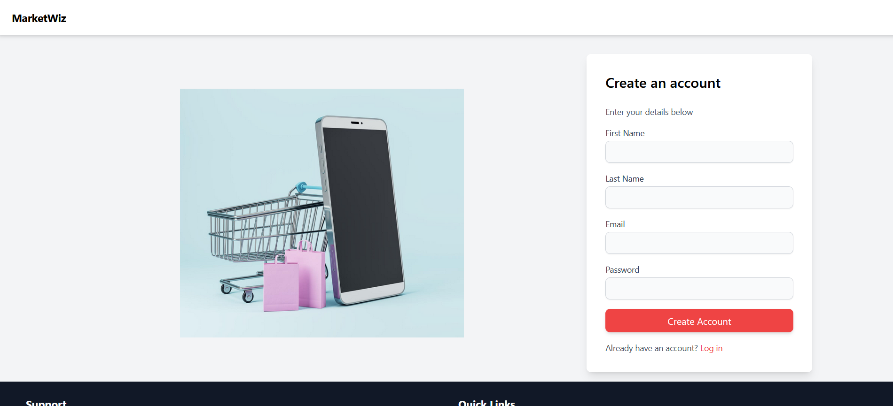
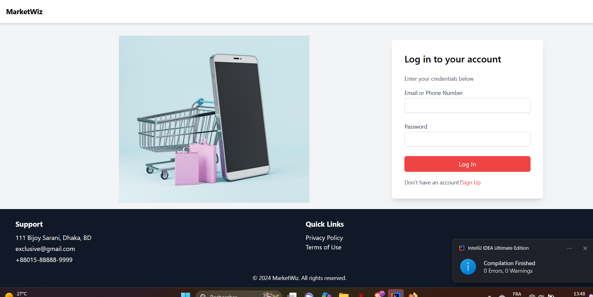
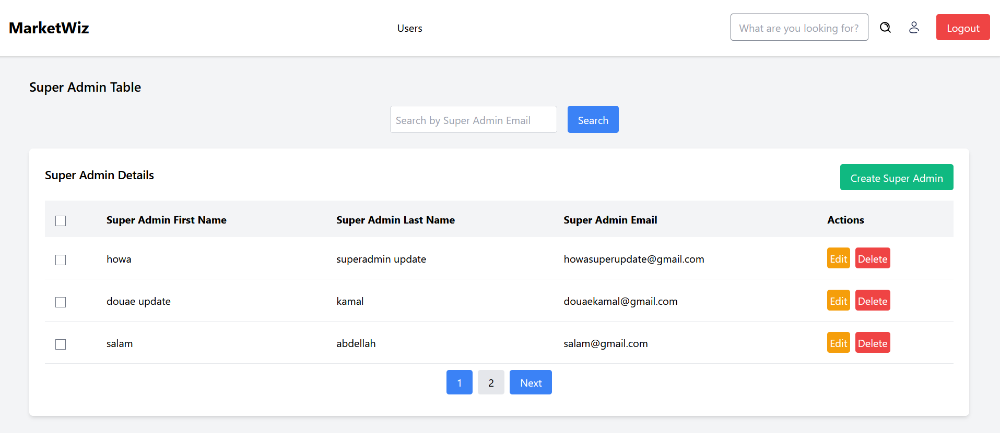
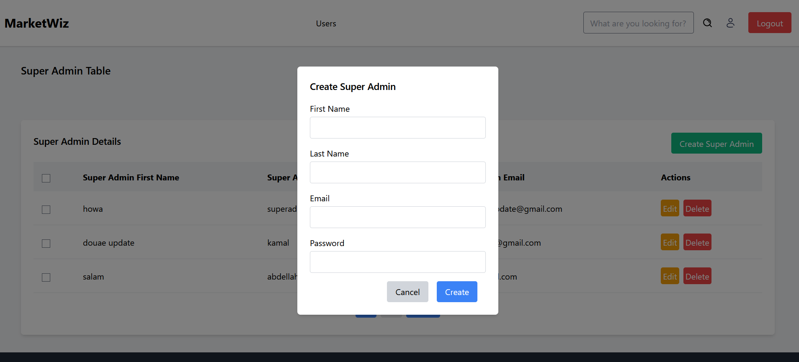
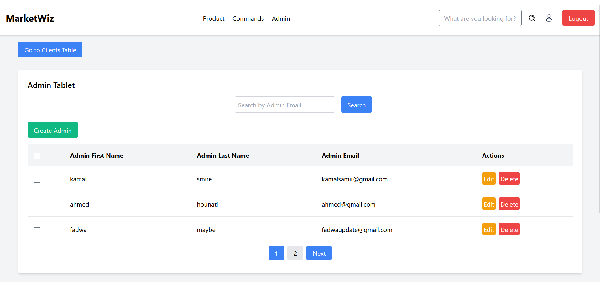
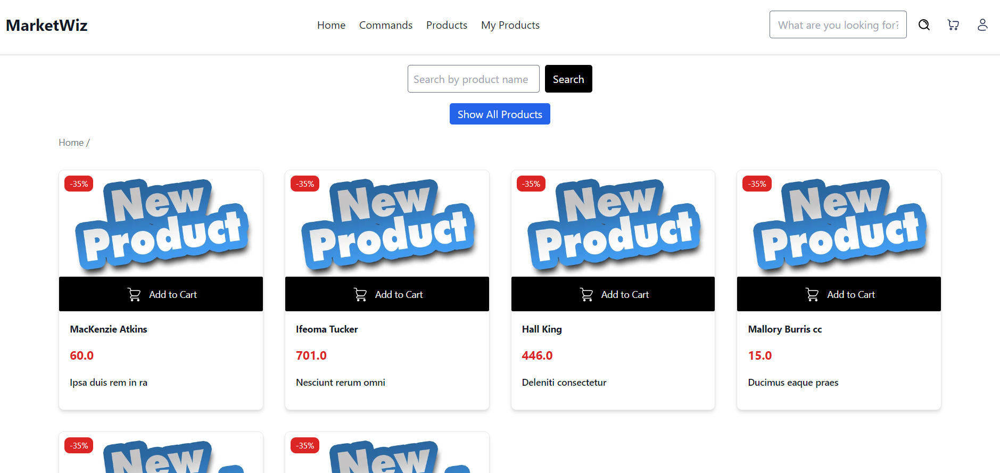
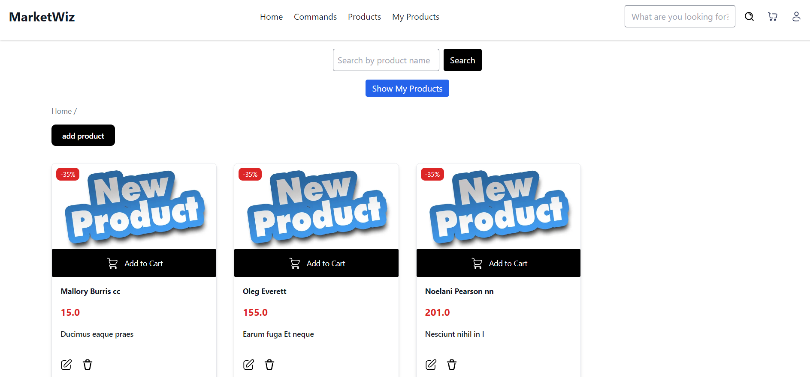
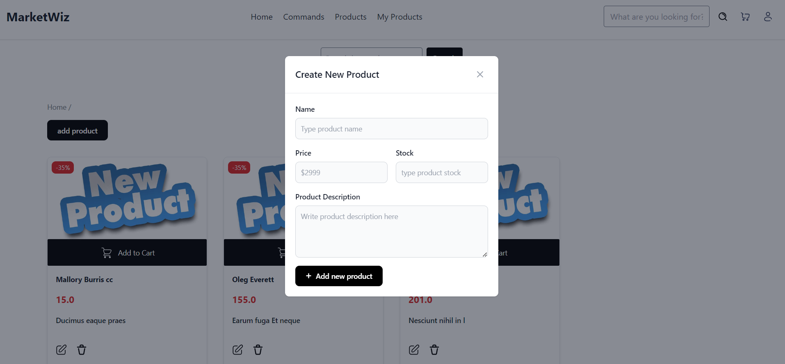
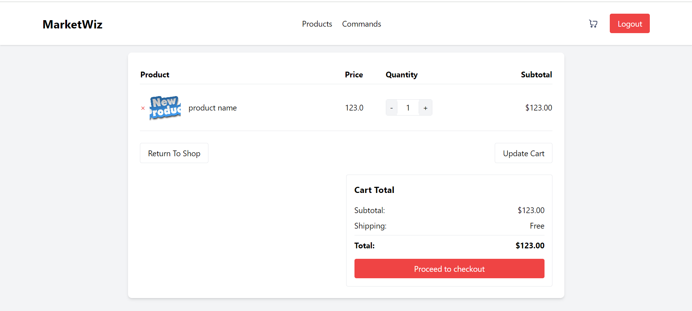
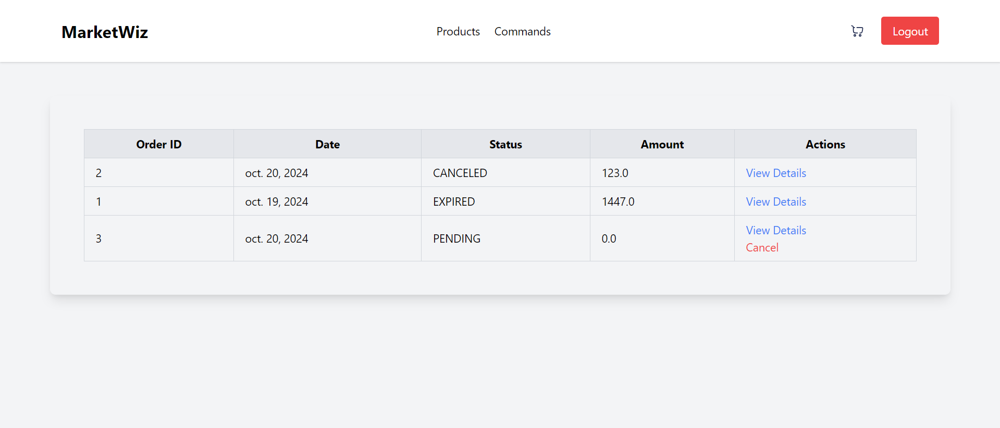

# Marketplace Web Application

## Description du projet
Ce projet est une application web de gestion de marché en ligne. Il permet aux administrateurs de gérer les produits, les commandes, et les utilisateurs, tandis que les clients peuvent naviguer, rechercher des produits et passer des commandes. L'application utilise une interface utilisateur simple pour faciliter la gestion des produits et des utilisateurs.

## Objectif général de l'application
L'objectif principal de cette application est de fournir une solution efficace de gestion de produits et d'utilisateurs pour un site de e-commerce. Elle permet aux administrateurs de superviser le catalogue de produits, de gérer les commandes, et de modérer les utilisateurs, tout en offrant aux clients une expérience fluide pour effectuer des achats.

## Technologies utilisées
- **Langage** : Java 8
- **Frameworks** : Servlets, Thymeleaf
- **Moteur de base de données** : PostgreSQL
- **ORM** : Hibernate JPA (5.6.1.Final)
- **Serveur** : Tomcat
- **Système de gestion des dépendances** : Maven
- **Testing** : JUnit, Mockito
- **CSS** : Tailwind CSS

## Structure du projet
Structure du projet
Le projet est organisé suivant une architecture MVC stricte et en couches, avec les principales sections suivantes :

- templates : Thymleaf pour l'interface utilisateur, avec des pages pour la gestion des utilisateurs, produits et des commandes.
- Entity : Classes Java représentant les entités (User, Admin, Client, Product, Command) avec leurs attributs.
- Servlet : Servlets pour gérer les requêtes et réponses HTTP, traitant les interactions utilisateur, notamment pour la création et l'affichage des produits et commandes.
- Service : Contient la logique métier, y compris les services pour la gestion des utilisateurs et produits, et coordonne les opérations entre le contrôleur et la couche DAO.
- Dao : Gère l'accès aux données, en effectuant des opérations CRUD sur la base de données via Hibernate.


## Description brève de l'architecture adoptée
L'application suit le modèle d'architecture MVC (Model-View-Controller) avec une séparation claire entre les différentes couches de l'application :
- **Entity** : Géré par Hibernate JPA, représentant les entités comme `Product`, `Commande`, `Utilisateur`.
- **Templates** : Géré par Thymeleaf pour le rendu des pages dynamiques côté client.
- **Servlet** : Géré par des Servlets qui contrôlent le flux d'information entre le modèle et la vue.
  L'accès à la base de données est effectué via des DAO (Data Access Object) et l'injection de dépendance permet une gestion claire des services et des DAO.

## Instructions d'installation et d'utilisation
### Prérequis
- Java 8
- Maven
- PostgreSQL
- Tomcat 9
- Navigateur compatible HTML5 (Chrome, Firefox, etc.)

### Étapes d'installation
1. Clonez le dépôt du projet :
   ```bash
   git clone https://github.com/ATalemsi/Marketpalce_java.git

2. Accédez au répertoire du projet :
    ```bash
    cd marketPlace

3. Configurez les dépendances Maven :
   ```bash
    mvn clean install
   
4. Configurez votre base de données PostgreSQL (voir ci-dessous).

**Étapes pour configurer la base de données** 
- Créez une base de données PostgreSQL :

CREATE DATABASE marketplace_db;

- Modifiez le fichier persistence.xml pour correspondre à vos paramètres PostgreSQL (nom d'utilisateur, mot de passe, URL de la base de données) :
xml
    ```bash
    <property name="hibernate.connection.url" value="jdbc:postgresql://localhost:5432/marketplace_db"/>
    <property name="hibernate.connection.username" value="votre_nom_utilisateur"/>
    <property name="hibernate.connection.password" value="votre_mot_de_passe"/>


### Comment lancer l'application sur Tomcat
1. Compilez et packagez le projet sous forme de fichier WAR :
    ```bash
    mvn package
2. Copiez le fichier WAR dans le répertoire webapps de Tomcat 
    ```bash
    cp target/marketplace.war 
3. Démarrez Tomcat et accédez à l'application via http://localhost:8080/marketplace.
## Captures d'écran

### Page d'Authentification



### Page de gestion des utilisateurs





### Page de gestion des produits






### Page de gestion des commandes



## Améliorations futures possibles
Amélioration de l'interface utilisateur : Ajouter plus de fonctionnalités AJAX pour éviter les rechargements de page complets lors des actions CRUD.
Amélioration de la sécurité : Mettre en œuvre une authentification plus robuste avec JWT ou OAuth 2.0.
Fonctionnalités supplémentaires : Ajouter un système de paiement pour compléter les commandes.
Internationalisation : Support de plusieurs langues pour atteindre un public plus large.
## Idées pour étendre ou améliorer le projet
Ajouter une fonctionnalité de filtrage avancé des produits (par prix, catégorie, popularité).
Implémenter un système de gestion des avis des clients sur les produits.
Ajouter une fonctionnalité de génération de rapports pour les administrateurs afin de suivre les commandes et les utilisateurs.
## Auteur et contact
Nom: [Idelkadi Radia]
GitHub: https://github.com/Radiaidel

-----------------------------------

Nom: [Talemsi Abdellah]
GitHub: https://github.com/ATalemsi

-----------------------------------
Nom: [Sebti Douae]
GitHub: https://github.com/Douaesb


Merci d'avoir consulté ce projet. Pour toute question ou suggestion, n'hésitez pas à me contacter!
